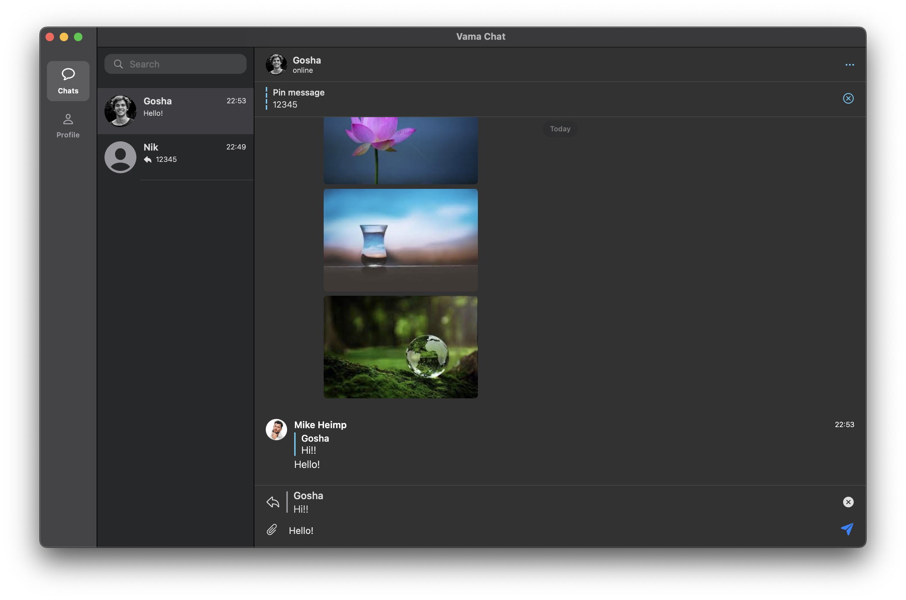

# Vama Chat

Simple chat application for macOS 13 

### Stack and technology ⚒️
- Swift
- SwiftUI
- Combine
- Firebase
- NukeUI

### Features ⭐️

- Registration by email and password
- Create user profile
- Update user profile
- Search users
- Create chat
- Text message
- Image message
- Replay message
- Forward message
- On drop images
- Select message
- Draft message
- Handle user is online status
- Dialod actions
- Custom app commands

## 📹 Video 

## 📷 Screenshots
 

   
  
   
   
   
   
  
   

   

   

## Author
* [Bogdan Zykov](https://github.com/BogdanZyk)

## License

 Copyright 2023 Bogdan Zykov.
 [License MIT](https://opensource.org/licenses/MIT)
